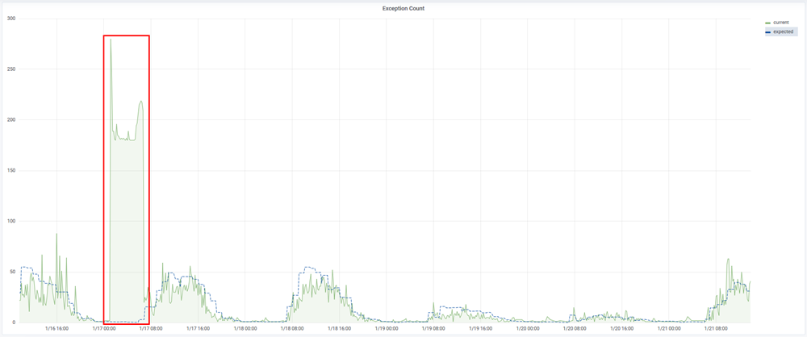
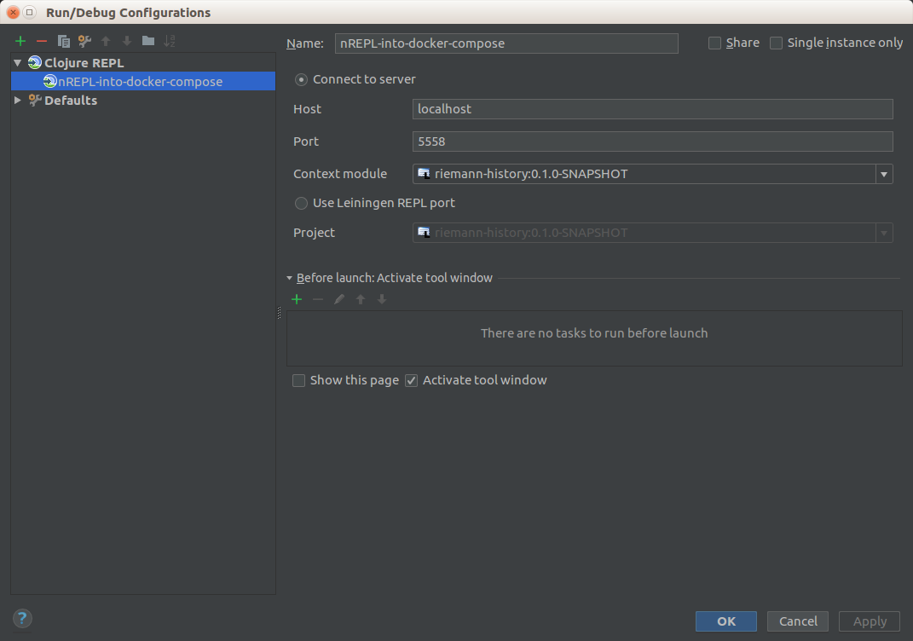

# riemann-history

A Riemann plugin called riemann-history

## Goal

Since Riemann does not have any persistence layer it is not straightforward to implement adaptive thresholds. This plugin tries to solve this by querying Elasticsearch as its datasource for historical data. The following image shows an example:



The Grafana graph shows exceptions over time. The green line is the actual value and the blue line shows the expected value generated from historical data. The red square highlights an anomaly which could be alerted upon.

## Usage

### Build

```
lein uberjar
```

### run dev environment

1) lein uberjar
1) docker-compose -f docker/compose.yml up
1) connect your repl using either
    1) ```lein repl :connect 127.0.0.1:5558```
    1) 
1) (re)load riemann-history.core etc through REPL

### Add to classpath

```
export EXTRA_CLASSPATH=<path>/riemann/riemann-0.3.0/plugins/riemann-history-0.1.0-SNAPSHOT.jar
```

### Elasticsearch example query

```
{
    "size": 0,
    "query": {
        "bool": {
            "must": [{
                "term": {
                    "tags": {
                        "value": "exception"
                    }
                }
            }],
            "filter": {
                "range": {
                    "@timestamp": {
                        "from": "now-35d",
                        "to": "now"
                    }
                }
            }
        }
    },
    "aggs": {
        "avg_exceptions_per_day_of_week": {
            "terms": {
                "script": {
                    "lang": "painless",
                    "source": "doc['@timestamp'].value.dayOfWeek + ':' + doc['@timestamp'].value.hourOfDay"
                },
                "size": 168
            },
            "aggs": {
                "number_of_weeks": {
                    "date_histogram": {
                        "field": "@timestamp",
                        "interval": "week"
                    }
                },
                "exceptions_per_day_of_week": {
                    "bucket_script": {
                        "buckets_path": {
                            "doc_count": "_count",
                            "number_of_weeks": "number_of_weeks._bucket_count"
                        },
                        "script": "params.doc_count / params.number_of_weeks"
                    }
                }
            }
        }
    }
}
```

### Riemann example config

```
(load-plugins)

(require '[riemann-history.core :as history])

(logging/init {:file "/tmp/riemann.log"})

; Listen on the local interface over TCP (5555), UDP (5555), and websockets
; (5556)
(let [host "0.0.0.0"]
  (tcp-server {:host host
               :port 5555})
  (udp-server {:host host})
  (ws-server  {:host host}))

; Expire old events from the index every 5 seconds.
(periodically-expire 5)

(defn transform-exception-resultset
  [buckets]
  (clojure.walk/keywordize-keys (into {} (map (fn [bucket] {(:key bucket) (get-in bucket [:exceptions_per_day_of_week :value])}) buckets))))

(def exception-history
  (history/history {:name :exceptions-per-day-hour
                    :connect "http://elasticsearch.service.consul:9200"
                    :url "log-*/_search"
                    :query "/opt/riemann/etc/rh-queries/rh-exceptions.json"
                    :aggregation :avg_exceptions_per_day_of_week
                    :transform-fn transform-exception-resultset}))

(let [index (default :ttl 120 (index))]
  (streams
    (tagged "exception"
            (fixed-time-window 600
                               (where* (fn [events] (> (count events) 0))
                                       (smap (fn [events]
                                               (let [exc (count events)
                                                     query-key (history/generate-key (:time (last events)))
                                                     avg (/ (history/get-history-data
                                                              :exceptions-per-day-hour
                                                              query-key)
                                                            6)]
                                                 (event {:service "prod.exceptioncount"
                                                         :metric exc
                                                         :history avg
                                                         :host nil
                                                         :projectid (:projectid (last events))
                                                         :targetid (:targetid (last events))
                                                         :eventtype "riemann-history"})))
                                          store))))))
```

## License

Distributed under the Eclipse Public License, the same as Clojure.
